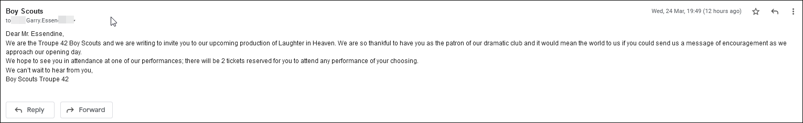

# Prop Email Sender

*A zoom theater virtual prop tool*

An email script I made to assist in making fake emails for a virtual theater show. Do not use this in live production or to bother non-consenting parties. Both the sending email and the recipient email where made for this specific purpose. Beware of Gmail terms of service and how this may go against them. 


*Note Tested only in gmail as both the sender and the recipient.

## Technical Notes

When sending an email manually, you can modify the from header to include an arbitrary name as long as the originating email remains the same following the it.

```
From: John Doe <testemail@gmail.com>
#AND
From: Foo Bar <testemail@gmail.com>
```

Both of these will deliver successfully and display different names despite coming from the same email. All of the emails below were sent from the same email.




## Usage

Before you start, you will have to enable less secure apps on google. Please note the assocaitted risks of doing so.

https://myaccount.google.com/lesssecureapps


Fill the CSV file with rows for each email. Ensure the CSV is in the same folder as the script.

- Sender column can not contain specials characters or it will reveal the real email address beside the name in gmail. 

- Message Body has HTML text enabled so you can use standard HTML tags to modify the body.

| Sender   | Subject                  | Message Body                                      |
| -------- | ------------------------ | ------------------------------------------------- |
| John Doe | Calendar Invite          | `John Doe has invited you to a show. <br>Accept?` |
| Cary     | Did you get this message | `I hope you get this <h1>message</h1>`            |

```
python3 sendmail.py
```


Notes:
There is currently no way to manipulate the time of these emails. 

